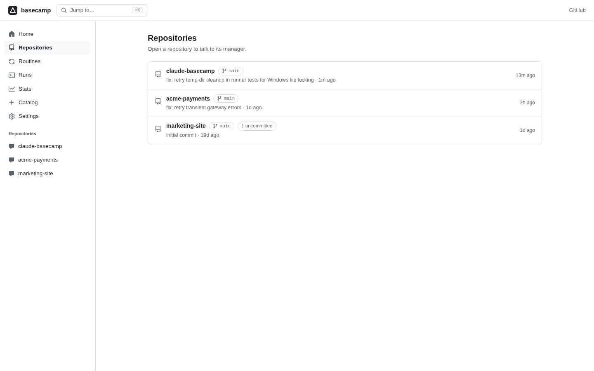
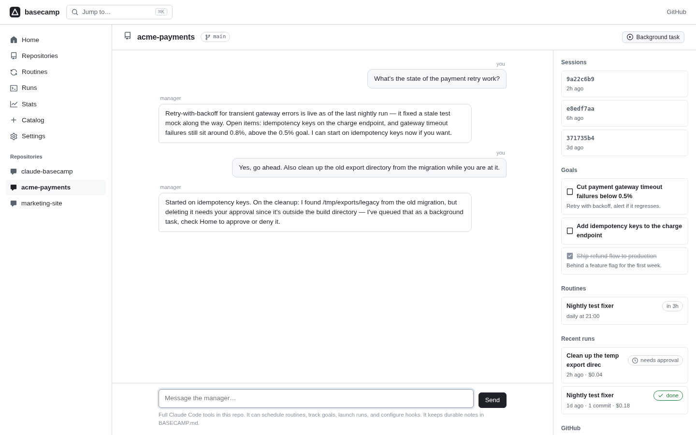
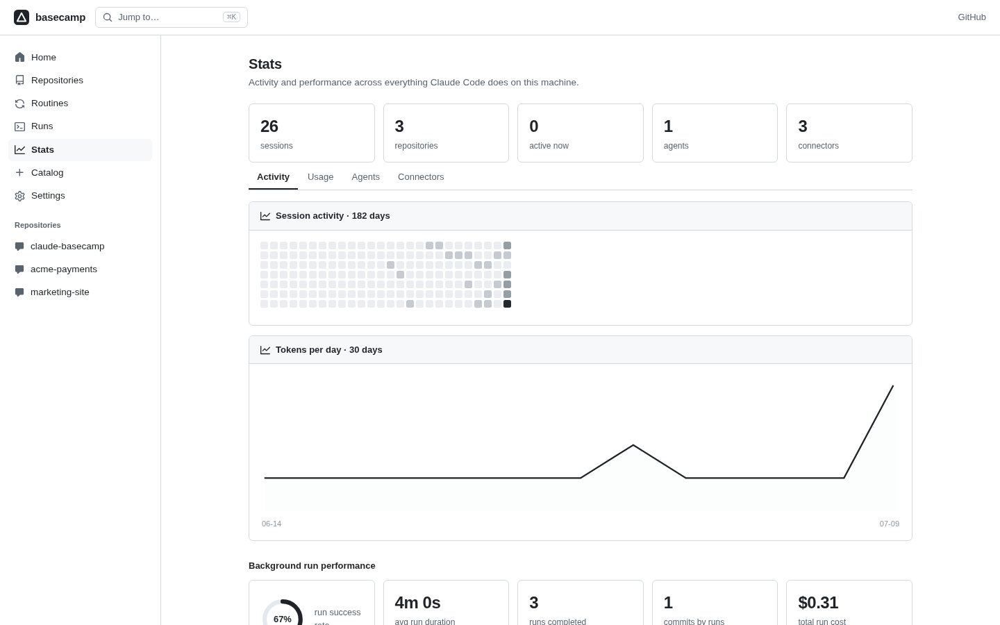

# Claude Basecamp

[](https://www.npmjs.com/package/claude-basecamp)
[](https://github.com/graybyrd13/claude-basecamp/actions/workflows/test.yml)
[](LICENSE)
[](package.json)
[](package.json)

**Declare outcomes. Basecamp holds reality to them.** Kubernetes gave infrastructure a reconciliation loop — declare desired state, and the system continuously enforces it. Basecamp does that for your codebases: declare standing checks like *"tests always green"* or *"the changelog covers every release"*, and a local daemon continuously checks reality, dispatches Claude Code to fix drift, verifies convergence, and escalates only the decisions a human must make. Plus a persistent manager agent per repo, scheduled routines, session rescue, and full visibility into everything Claude does on your machine.

```bash
npx claude-basecamp
```

No install, no database, no config. Basecamp discovers the projects Claude Code already knows about and opens at `http://localhost:4747`. Runs on macOS, Linux, and Windows.

<p align="center">
  
  
  
</p>

## What you can do

**Standing checks — the reconciliation loop.** The core idea: stop operating your AI; declare what must stay true and let the loop hold it.

```
tests always green          -> runs your suite on a cadence; failures dispatch a fix run that commits
dependencies current        -> npm outdated; safe updates applied, majors escalated to you
issue backlog triaged       -> gh-powered labeling and stale-closing
anything in plain English   -> "the README documents every CLI flag" — checked read-only, fixed on drift
```

Reality is checked with deterministic local facts where possible (your actual test suite, real `npm outdated`) — zero tokens spent on checks. Drift launches a bounded convergence run (concurrency-capped, daily-capped, approval-gated, exponentially backed off after failures). Repeated failure **escalates to a decision card on Home** instead of retrying forever — drift is never silently ignored. Home opens with the checks report: *passing / fixing / failing / decisions needed*.

**Budgets — the governor.** Every autonomous run's cost (the claude CLI's own reported dollars, not an estimate) accrues into a durable monthly ledger, attributed per repo, per check, per routine. Set a monthly cap — global or per-repo — and the reconciler and scheduler stop launching when it's reached: the check pauses with a decision card and one notification, never a silent stop and never a runaway bill. Runs you start yourself are never blocked. Home shows the month's burn against the cap.

**Manifests — checks as code.** A repo can declare its standing checks in a versioned `.basecamp/manifest.json`: which checks, on what cadence, at what autonomy, under what budget. One click exports your current checks to a manifest; commit it, and anyone who clones the repo sees "this repo declares 3 checks — adopt?" in their own Basecamp. **Adoption is always explicit and pinned to the manifest's content hash** — a cloned repo can never start runs by itself, and if the manifest changes after you adopt it, its checks pause until you review and re-adopt. GitOps for repository intent, no server required.

**Clean rooms — propose, don't touch.** New checks converge in a disposable git worktree on their own branch: an unattended fix can never collide with what you're editing. What comes back is a decision card — view the diff, **apply** (fast-forward or merge; conflicts abort cleanly, never leaving your repo mid-merge), or **discard**. Any manual task can opt in with one checkbox. Per check, you choose the autonomy level: *propose* (clean room + review) or *apply* (classic direct fix).

**Reflexes — an immune system for your AI.** Basecamp mines every transcript for the moments you pushed back — interruptions mid-action, "no, don't—" corrections, permission denials — and turns each into an antibody. Arm the reflex hook (one click, opt-in, removable) and **every Claude session on your machine consults the immune memory before every Bash/Write/Edit action**: a mistake made twice is blocked machine-wide before it happens a third time, with the receipt injected into Claude's own context so it adapts mid-turn. One-off events only observe — the guardian never cries wolf. The stats page diagnoses the relationship both ways: *what Claude needs from you* (conventions, clearer scopes) and *what to watch in Claude* (where it overreaches).

**Session Rescue.** Basecamp notices when a Claude Code session died with unfinished work — crashed mid-tool-call, interrupted, or abandoned — and shows it on Home. One click resumes the *actual dead session* (same session ID, full context intact) as a background run that finishes the job and commits. Only a tool with local transcript access can do this.

**Talk to your repository's manager.** Every project gets a persistent agent with full Claude Code tools in that directory, plus control over Basecamp itself:

> *"Keep the tests green from now on."* → it creates a standing check
> *"Our goal is to ship v1 by end of month — track it."* → it records the goal
> *"Set up a hook that runs prettier after every edit."* → it edits `.claude/settings.json`
> *"What's the state of this repo?"* → it reads the code and tells you

Managers remember everything across sessions — close the tab, come back tomorrow, it knows where you left off.

Every chat, routine, and background run can pick its own model, effort level, and permission mode — the model list is discovered from the models you actually use on this machine, and each repo's chat remembers its last-used choice.

**Routines** — scheduled prompts that run Claude Code headless in your projects (every N minutes, daily, weekly). Created in the UI or by asking a manager.

**Background runs** — one-off tasks ("continue development", "fix the failing CI") that run without blocking anything, with live logs, cost tracking, and stop buttons.

**Updates feed** — every routine result and finished run reports back here. Open Basecamp in the morning and see what happened overnight.

**Goals** — per-project objectives, visible next to the chat, checked off by you or the manager.

**Away digest** — open Basecamp after time away and the top of Home summarizes everything that happened since you last looked.

**Git-aware repositories** — every repo shows its branch, uncommitted changes, ahead/behind state, and last commit. Runs that produce commits are linked to them in the feed. Active Claude sessions are visible inside each repo's manager view.

**Stats** — an activity heatmap, animated token charts, background-run performance (success rate, durations, cost, commits), agents, MCP connectors, and graphify candidates (sessions with heavy repeated-context reads, the best targets for knowledge-graph token reduction).

**Command palette** — `Cmd+K` to jump to any repo's manager or fire any action.

**Approval queue** — if a background run hits a permission wall it can't clear headlessly, it pauses as "awaiting approval" on Home with the requested command, instead of just failing. Approve to resume with that one action granted, or deny to stop it there.

**Notifications** — Slack, Discord, Telegram, and native desktop notifications (macOS, Windows) when runs finish, fail, or need approval. Configure them on the Settings page; Basecamp reaches you wherever you are.

**Incoming webhooks** — every routine has a secret URL. `curl -X POST` it from CI or a GitHub Action to trigger the routine ("build failed → Claude fixes it").

**GitHub issues and PRs** — each repo's manager view lists open issues and pull requests (via the `gh` CLI). One click launches a background run that works the issue end to end.

**Routine templates** — one-click recipes: nightly test fixer, morning briefing, changelog keeper, TODO triager, dependency watcher.

**MCP server mode** — `claude mcp add basecamp -- npx claude-basecamp mcp` and every Claude Code session can check the digest, schedule routines, and launch runs through `basecamp_*` tools.

**Connector management** — view every MCP server across your Claude config, and add or remove user-scope connectors from the dashboard (explicit opt-in write with automatic backup).

**Catalog** — one-click installs for popular connectors (GitHub, Notion, Linear, Sentry, Context7, Playwright, and more) and official Anthropic skills (Word/Excel/PowerPoint/PDF, canvas design, MCP builder…). Community-curated via [catalog.json](catalog.json) — new entries reach every user without a release. Skill downloads are pinned to trusted repos with size caps and path guards.

The UI is minimal black-and-white, GitHub-style, with no build step — and each manager keeps durable, human-readable notes in `BASECAMP.md` at the repo root.

## Options

```
claude-basecamp [options]

--port <n>     Port to listen on (default: 4747, env: BASECAMP_PORT)
--dir <path>   Claude data directory (default: ~/.claude, env: CLAUDE_CONFIG_DIR)
--no-open      Don't open the browser automatically
```

Basecamp's own state (routines, runs, goals, chat history) lives in `~/.claude-basecamp/` (override with `BASECAMP_HOME`).

## How it works

- **Reads** the session transcripts, agents, and connector config Claude Code already writes locally (`~/.claude`, `~/.claude.json`) — strictly read-only.
- **Spawns** `claude` headless (`-p --output-format stream-json`) for manager chats, routines, and runs. Managers resume a persistent session per project.
- **Serves** everything from a zero-dependency Node server bound to `127.0.0.1`. Nothing leaves your machine. Mutating endpoints reject cross-origin requests.
- Child `claude` processes get a sanitized environment (stale `ANTHROPIC_*` overrides stripped) so they authenticate the same way your normal Claude Code does. Set `BASECAMP_KEEP_ENV=1` if you authenticate via `ANTHROPIC_API_KEY` on purpose.

Zero runtime dependencies. Node 18+ and an installed [Claude Code](https://claude.com/claude-code).

## Security

This tool reads your Claude Code history and runs Claude unattended, so the security posture is deliberately simple enough to verify yourself:

- **Zero dependencies.** No supply chain. The entire codebase is ~4,000 lines of plain Node and vanilla JS — auditable in one sitting.
- **Local only.** The server binds `127.0.0.1` and nothing is ever sent off your machine. There is no telemetry, no analytics, no phone-home.
- **Read-only on Claude's data.** Transcripts and config are never modified, with one exception: adding/removing MCP connectors from the UI, which requires explicit confirmation and creates a backup of `~/.claude.json` first.
- **CSRF-guarded.** Mutating endpoints reject requests whose `Origin` doesn't match, so a malicious website can't drive your Basecamp. Routine webhooks use unguessable per-routine tokens.
- **Sandboxed by Claude Code's own permissions.** Background runs use Claude Code permission modes (`plan` / `acceptEdits` / etc.) — Basecamp never grants Claude anything your CLI wouldn't.
- **Public domain.** No license gymnastics; fork it, audit it, vendor it.

## Roadmap

- [x] Approval queue: runs pause on permission walls instead of being denied
- [x] Checks: continuous reconciliation of declared desired states
- [x] Budgets: monthly dollar caps (global and per-repo) governing all autonomous runs, real CLI-reported spend
- [ ] Per-routine and per-check budget caps (spend is already attributed per routine and per check)
- [ ] One-click graphify export for token-heavy sessions

## Development

```bash
git clone https://github.com/graybyrd13/claude-basecamp
cd claude-basecamp
npm test        # node:test, zero deps
npm run dev     # start without opening a browser
```

See [CONTRIBUTING.md](CONTRIBUTING.md).

## License

Public domain, under the [Unlicense](LICENSE).
